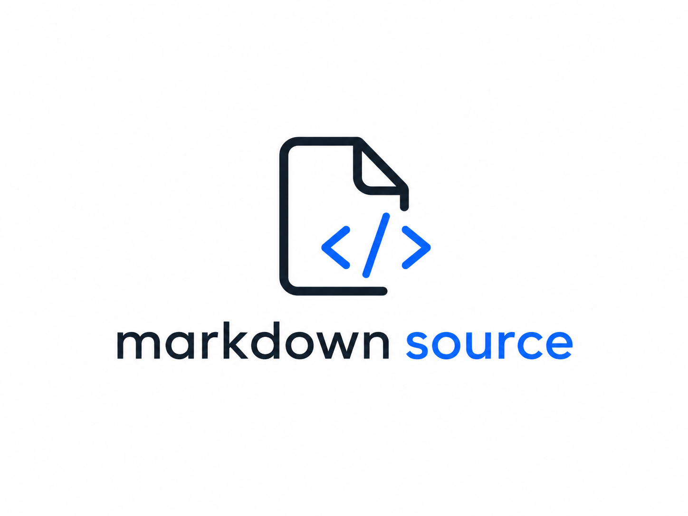

<p align="center">
	
</p>

# mds

> *This document was translated from [Japanese](README.ja.md) by AI.*

mds is a development toolchain that treats Markdown as the source of truth for both design and implementation.

Write real code — TypeScript, Python, Rust — inside Markdown code blocks, then extract them as executable source files with `mds build`. Because the code in Markdown is the actual running code, design intent and implementation always stay in sync.

## Features

- Generate `.ts`, `.py`, `.rs` files from `Types`, `Source`, `Test` code blocks in Markdown
- `mds lint` validates Markdown structure and runs configured linters against code in Markdown
- `mds typecheck` / `mds test` runs type checks and tests against code in Markdown
- `mds init` initializes a project with an interactive wizard

## Quick Start

```bash
# Install
curl -fsSL https://raw.githubusercontent.com/owo-x-project/owox-mds/main/install.sh | sh

# Basic usage
mds init --package ./path/to/package
mds lint --package ./path/to/package
mds typecheck --package ./path/to/package
mds build --package ./path/to/package
```

VS Code extension: `code --install-extension owo-x-project.mds`

See [examples/](examples/) for minimal working configurations.

## Requirements\n\nNo runtime dependencies — mds is a single static binary.

## Documentation

| Audience | Entry point |
| --- | --- |
| **Users** | [Wiki (EN)](docs/wiki/en/index.md) — Getting started, commands, configuration, generation, troubleshooting |
| **Contributors** | [CONTRIBUTING.md](CONTRIBUTING.md) — Setup, dev workflow, testing |

[日本語版 README](README.ja.md) | [日本語 Wiki](docs/wiki/ja/index.md)

### Key links

- [Getting Started](docs/wiki/en/getting-started.md) — Prerequisites and minimal setup
- [Commands](docs/wiki/en/commands.md) — Full command reference
- [Descriptor Guide](docs/wiki/en/descriptors.md) — Language, quality tool, and package manager TOML guide
- [Development Guide](docs/wiki/en/development.md) — Build, test, debug
- [AI Agent Integration](docs/wiki/en/ai-agent-integration.md) — Claude Code, Codex, Opencode, GitHub Copilot
- [Editor Integration (LSP)](docs/wiki/en/editor-integration.md) — VS Code extension, Neovim, real-time diagnostics

## Contributing

Bug reports, documentation improvements, and implementation improvements are welcome. See [CONTRIBUTING.md](CONTRIBUTING.md) for details.

## License

MIT License. See [LICENSE](LICENSE) for details.
